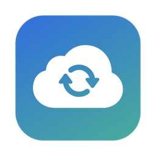

<p align="center">
  
</p>

<h1 align="center">Burrow</h1>

<p align="center">
  Automatic Mac backups to any SFTP server – with every old version kept.<br>
  A native macOS app with scheduled backups, version history and a file browser. Works with any SFTP server:
  your own VPS or NAS, a hosting account, or a storage service such as Hetzner Storage Box (built-in preset).
</p>

<p align="center">
  
  
  
</p>

> **Beta.** 0.4 is the first public release. It is tested against OpenSSH, Hetzner Storage Box and rclone's SFTP
> server. Read [What Burrow is – and isn't](#what-burrow-is--and-isnt) before you rely on it, and keep a second,
> independent copy of anything you can't afford to lose.

---

## Why

An SFTP storage server is a practical place to keep work off-site. What's missing is a
simple, trustworthy way for a Mac user to *use* it as a backup:

- **Plain sync is not a backup.** Delete a folder by accident (or get hit by ransomware) and a naive
  sync happily propagates the damage to your only copy.
- **Command-line tools work, but nobody checks them.** A cron job that silently failed three weeks ago
  looks exactly like one that works.

Burrow wraps [rclone](https://rclone.org) in a small menu-bar app that answers the only
questions that matter: *When was my last good backup? What changed? Can I get the old version back?*

## Features

### File browser

- **Bookmarks** for any number of SFTP servers (Storage Box, your own VPS, client servers) – SSH key or
  password (stored in the macOS Keychain).
- **Browse** in list or icon view, sort by name/date/size/kind, path bar, back/forward, hidden files toggle,
  **recursive search**.
- **Quick Look** any remote file with the space bar.
- **Drag & drop upload** of files and whole folders from Finder; right-click to download one file, a selection, or a folder to a location you choose.
- **File history in the browser** for files in the configured backup: preview, open a local copy, or download an archived version.
- **Transfer queue** with live progress, speed and ETA, pause/resume, cancel, retry and history.
- **File management**: new folder, rename, duplicate, cut/copy/paste, Get Info (incl. folder size), copy path.
- **Safe delete**: "Move to Trash" moves items into a dated trash folder on the server, and **Put Back**
  restores them to where they were. Uploading over an existing file offers *Keep Both*, *Replace* (the old
  copy goes to the trash) or *Skip*. Permanent deletion only happens inside the trash, after confirmation.

### Backup

- **Scheduled backups** via a LaunchAgent – daily or weekly, runs even when the app is closed, catches
  up after sleep and, after a shutdown, at the next login.
- **Version history** – files you change or delete locally are moved into a dated archive folder on the
  box instead of being overwritten. Old versions are pruned after a configurable retention period.
- **Safety brakes**
  - blocks a run if the local file count suddenly drops (unmounted drive, accidental delete, ransomware)
    until you confirm it,
  - blocks the first run after a folder change (or on a new Mac) if the local folder has far fewer files than
    the backup folder on the server,
  - caps how many files a single run may archive,
  - refuses to run on an empty or unreadable source folder.
- **Preview changes** – a dry-run that lists exactly what would be uploaded and what would be archived.
- **Restore** single files or whole versions into `~/Downloads` – your working folder is never overwritten.
- **Live progress**, run history with per-run logs, macOS notifications, Storage Box quota.
- **SSH key setup** – use an existing key, or install a dedicated key on a compatible server; the app
  never stores the password.
- **Optional server-side checksums** – enable remote shell commands on servers that permit them. Generic SFTP connections work without an SSH shell.
- **In-app updates** through Sparkle for signed public releases, with automatic checks and a manual check in About.
- English, Croatian and German UI – English by default, switchable in Backup Settings → Language.

## How it works

The browser talks to a local `rclone rcd` process started by the app: it listens on `127.0.0.1` only, on a
random port with random per-session credentials (passed through the environment, so they never show up in the
process list), keeps SFTP connections open (so folders open quickly)
and runs uploads/downloads as jobs with live statistics. Folder listings are cached (bounded LRU, persisted
in `~/Library/Caches`) and refreshed in the background, and subfolders are prefetched, so navigation is instant
even on a slow connection; anything that could overwrite data re-checks the server first. Servers are passed to rclone as in-memory
connection strings, so saved passwords never touch disk.

Backups:

```
~/Desktop/Projects  ──rclone sync──▶  box:/home/Projects            (exact mirror)
                                   └▶ box:/home/_versions/2026-09-26_210005-1a2b3c4d/…
                                        (previous copies of changed + deleted files)
```

Each run is `rclone sync <local> <remote> --backup-dir <versions>/<unique-run-id>` over SFTP (the server's configured port).
The app itself is a thin, auditable layer: configuration, scheduling, safety checks, log parsing and a UI.
All state lives in:

| What | Where |
|---|---|
| Settings, run history, generated rclone config | `~/Library/Application Support/Burrow/` |
| One log file per run | `~/Library/Logs/Burrow/` |
| Schedule | `~/Library/LaunchAgents/hr.push.burrow.plist` |
| SSH key | `~/.ssh/burrow_ed25519` |
| Server bookmarks, transfer history | `~/Library/Application Support/Burrow/` |
| Server trash | `<login folder>/.burrow-trash/<date>/…` (configurable per server) |

## Install

1. Download the latest `Burrow-x.y.z.dmg` from [Releases](../../releases) and drag the app to
   **Applications**. If you open it straight from the disk image, the app offers to move itself there, because
   scheduled backups need a permanent location.
2. Open it. If macOS says it can't check the app for malicious software, open
   System Settings → Privacy & Security, scroll down and click **Open Anyway** (only needed once). On macOS 15 and
   later, right-click → Open no longer skips this step.
3. When you choose a folder in Desktop, Documents, Downloads, iCloud Drive or on an external drive, macOS asks once
   whether Burrow may read it. Click **Allow**. The app checks this the same way a scheduled backup
   reads the folder, so you know it works before the first night. Full Disk Access is not needed.

### Setting up an SFTP server

1. Open the setup assistant. Enter the SFTP host, port and username. Hetzner users can select the
   **Hetzner Storage Box** preset, which fills in its host format and port 23.
2. Confirm the server fingerprint and choose an SSH key accepted by the server. Scheduled backups require
   key authentication without a passphrase. The built-in installer creates `~/.ssh/authorized_keys` only when it is
   absent. If the server already has keys, append Burrow's public key manually so existing access is preserved.
3. Choose the local folder, a dedicated backup folder, and a separate versions folder. Save.
4. Recommended: run **Preview changes** once, then **Back up now**.
5. If your provider offers server-side snapshots, enable them as an independent recovery layer.

The first backup of an existing remote copy can take a while. Servers with SSH shell access can use
server-side checksums; otherwise rclone compares file size and modification time.

## What Burrow is – and isn't

**A mirror with a version window, not an archive.** The backup folder on the server always matches your local
folder. A file you change or delete on the Mac is moved to the versions folder on the next run and **deleted for
good after the retention period** (90 days by default, Backup Settings → Versions & safety). If you need to keep
something longer, keep it in the local folder.

**Not protection against someone who controls your Mac.** Scheduled backups log in with an SSH key that has no
passphrase and full access to the server account. Malware, or anyone using your Mac account, can use that key to
delete the backup and its versions. The safety brake stops a mass deletion on the Mac from reaching the server, but
files that ransomware encrypts in place look like ordinary edits: they're uploaded, and the good copies stay in the
versions folder only for the retention period. For protection that the Mac can't undo, turn on **server-side
snapshots**: automatic snapshots of a Hetzner Storage Box, ZFS or Btrfs snapshots on a NAS or your own server, or
whatever your provider offers.

**What isn't backed up:**

- symbolic links (rclone skips them), extended attributes, Finder tags and comments, and file permissions;
- system files: `.DS_Store`, `._*`, `.Spotlight-V100`, `.Trashes`, `.fseventsd`, `.TemporaryItems`;
- lock files of open documents (`~$*`, `*.idlk`, `.~lock.*#`) and rclone's partial uploads;
- files that only exist in iCloud (iCloud Drive with "Optimize Mac Storage"). This hasn't been tested yet; to be
  safe, right-click the backed-up folder in Finder and choose **Keep Downloaded**.

A file that is being written while a backup runs can fail to upload; it's picked up on the next run.

## Restoring everything on a new Mac

The backup is a plain copy of your files, so any SFTP client (Cyberduck, `scp`, `rclone`) can download it. With
Burrow:

1. Install Burrow and add your server under **Servers** (a new SSH key can be installed with the account password,
   see [Setting up an SFTP server](#setting-up-an-sftp-server)).
2. In the file browser, right-click the backup folder → **Download to…** and choose where it should live, for example
   your Desktop. Wait until the transfer has finished. Older versions of files are in the versions folder.
3. Finish the backup setup and choose the **downloaded folder** as the local folder and the same server folder as
   before. The assistant warns that the server folder isn't empty; here that's expected. The first run then finds
   nothing to upload.

**Never point an empty or nearly empty local folder at an existing backup.** The backup folder would be made to
match it: everything else there would be moved to the versions folder and deleted after the retention period.
Burrow blocks such a first run and asks for **Run anyway**. Only confirm it if that is really what you want.

## Build from source

Requirements: macOS 14+, Xcode or the Command Line Tools. The build downloads pinned, checksum-verified
releases of rclone and Sparkle.

```sh
git clone https://github.com/karlopusic/burrow.git
cd burrow
scripts/build.sh                 # → dist/Burrow-<version>.dmg (universal binary)
```

`Package.swift` lets you open the project in Xcode for editing; the app bundle itself is assembled by
`scripts/build.sh`. See [CONTRIBUTING.md](CONTRIBUTING.md) for details and [docs/ROADMAP.md](docs/ROADMAP.md)
for what's planned.

## FAQ

**Which servers does it work with?**
Any SFTP server that allows renaming files (needed for the version archive): your own Linux server or VPS,
a NAS, a hosting account, or a storage service. Browsing accepts SSH key or password login; unattended backups
need an SSH key. Every change is tested end to end against three different SFTP servers:

| Server | Tested |
|---|---|
| OpenSSH (Linux, macOS Remote Login, most VPS and NAS) | browser, transfers, all backup scenarios |
| Hetzner Storage Box | browser, transfers, all backup scenarios, daily use |
| rclone's SFTP server | browser, transfers, all backup scenarios (on every push, in CI) |

If you use it with another provider, a short note in the issues helps others.

**Why rclone and not restic/Borg?**
Those are excellent, but they store data in their own repository format. Burrow keeps a plain,
browsable copy of your files on the box – you can open any file from any machine without special tools.
If you need encryption and deduplication, restic or Borg is the better choice.

**Is my password stored?**
That depends on what you use it for:

- *Installing an SSH key* (setup assistant): no. The password is used once. It's kept in memory and in a private
  temporary file that is deleted right afterwards. Backups then log in with the key.
- *Server bookmarks with password login* (file browser): yes, in the macOS Keychain, like Safari or Finder do.
  It's never written to the app's own files or passed on a command line.

**Does the app collect any data?**
No. There's no analytics, no tracking and no account. The app only connects to the servers you add and, to check
for updates, to this repository's update feed on GitHub.

**What if I delete something by mistake?**
The deleted files are moved into the versions folder on the next run and can be restored from the
**Versions** tab until the retention period expires. If a large share of files disappears at once, the
backup is blocked until you confirm it.

## License

Burrow was called *StorageBox Sync* before version 0.4. Opening Burrow from an installed location imports an
existing installation (settings, history, logs, saved passwords and the schedule) once the old backup is idle.


MIT © 2026 [Karlo Pušić](https://push.hr). Burrow bundles rclone, which is MIT-licensed – see
[THIRD_PARTY_NOTICES.md](THIRD_PARTY_NOTICES.md).

Not affiliated with Hetzner Online GmbH.
